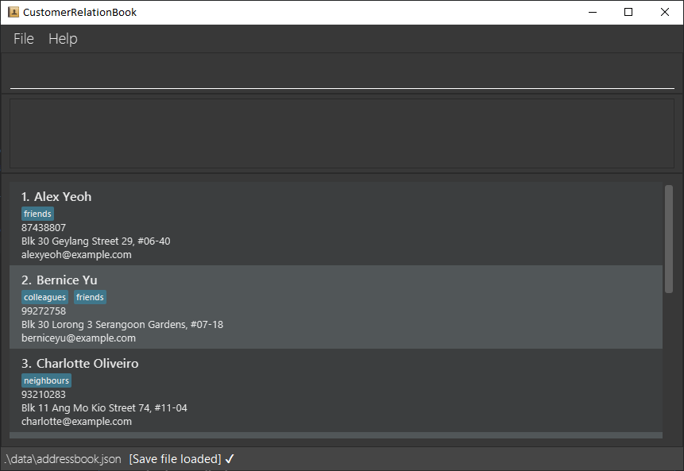

# CustomerRelationBook

## Introduction

CustomerRelationBook is a contact management system tailored towards typing-focused users. It provides a structured system to store, categorize and search business contacts, saving time and improving efficiency in client and vendor communications.

## Note

* This is a learning project for software engineering students that is based on the `AddressBook` project.
* Specifically, our team starts from the `Level 3` variant of the `AddressBook` codebase (referred to as `AB3`).
* For more information on our variant of the `AB3` project, please refer to our [CustomerRelationBook Website](https://ay2526s1-cs2103-f13-3.github.io/tp).

## Acknowledgement

  This project is based on the AddressBook-Level3 project created by the [SE-EDU initiative](https://se-education.org)
* For the detailed documentation of the `AddressBook-Level3` project, see the [Address Book Product Website](https://se-education.org/addressbook-level3).
* This project is a part of the se-education.org initiative. If you would like to contribute code to this project, see [se-education.org](https://se-education.org/#contributing-to-se-edu) for more info.
