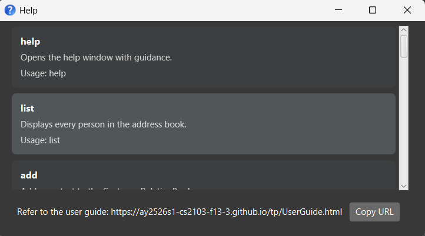
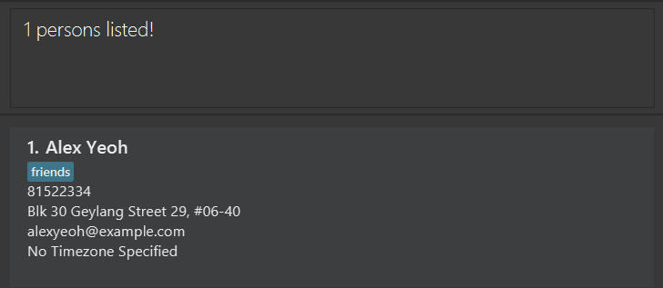
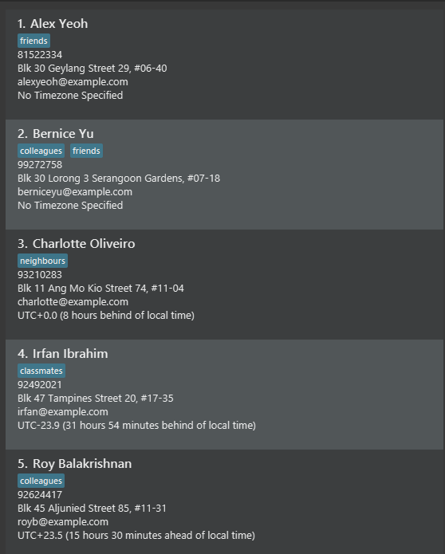

# Customer Relation Book User Guide

Customer Relation Book (CRB) is a **desktop app for managing contacts, optimized for use via a  Line Interface** (CLI) while still having the benefits of a Graphical User Interface (GUI). If you can type fast, CRB can get your contact management tasks done faster than traditional GUI apps.

<!-- * Table of Contents -->
<page-nav-print />

--------------------------------------------------------------------------------------------------------------------

## Quick start

1. Ensure you have Java `17` or above installed in your Computer. 
  **Mac users:** Ensure you have the precise JDK version prescribed [here](https://se-education.org/guides/tutorials/javaInstallationMac.html).

1. Download the latest `.jar` file from [here](https://github.com/AY2526S1-CS2103-F13-3/tp/releases).

1. Copy the file to the folder you want to use as the _home folder_ for your CustomerRelationBook.

1. Open a command terminal, `cd` into the folder you put the jar file in, and use the `java -jar CustomerRelationBook.jar` command to run the application. 
  A GUI similar to the below should appear in a few seconds. Note how the app contains some sample data. 
  

1. Type the command in the command box and press Enter to execute it. e.g. typing **`help`** and pressing Enter will open the help window. 
  **Some** example commands you can try:
  * `list` : Lists all contacts.
  * `add n/John Doe p/98765432 e/johnd@example.com a/John street, block 123, #01-01` : Adds a contact named `John Doe` to the Customer Relation Book.
  * `delete 3` : Deletes the 3rd contact shown in the current list.
  * `clear` : Deletes all contacts.
  * `exit` : Exits the app.

1. Refer to the [Features](#features) below for details of each command.

--------------------------------------------------------------------------------------------------------------------

## Features

<box type="info" seamless>

**Notes about the command format:** 
* Words in `UPPER_CASE` are the parameters to be supplied by the user. 
  e.g. in `add n/NAME`, `NAME` is a parameter which can be used as `add n/John Doe`.
* Items in square brackets are optional. 
  e.g `n/NAME [t/TAG]` can be used as `n/John Doe t/friend` or as `n/John Doe`.
* Items with `…` after them can be used multiple times including zero times. 
  e.g. `[t/TAG]…` can be used as ` ` (i.e. 0 times), `t/friend`, `t/friend t/family` etc.
* Parameters can be in any order. 
  e.g. if the command specifies `n/NAME p/PHONE_NUMBER`, `p/PHONE_NUMBER n/NAME` is also acceptable.
* Trailing spaces in parameters will always be stripped. 
  e.g. `note 1 nt/  hi  `, only leading spaces are accepted and the `note` will be `  hi`.
* Extraneous parameters for commands that do not take in parameters (such as `help`, `list`, `exit` and `clear`) will be ignored. 
  e.g. if the command specifies `help 123`, it will be interpreted as `help`.
* If you are using a PDF version of this document, be careful when copying and pasting commands that span multiple lines as space characters surrounding line-breaks may be omitted when copied over to the application.

</box>

### Viewing help: `help`

Shows a message explaining how to access the help page, along with a scrollable list of all available commands with their usage details, including command formats, parameters, and brief descriptions.

Format: `help`

### Listing all persons: `list`

Shows a list of all persons in the customer address book.

Format: `list`

### Adding a person: `add`

Adds a person to the customer relation book.

Format: `add n/NAME p/PHONE_NUMBER e/EMAIL a/ADDRESS [t/TAG]… [tz/UTC_TIMEZONE_OFFSET]`

<box type="tip" seamless>

**Note:** Users are not allowed to add `Note` field through the `add` feature. The `Note` field is omitted
to simplify the creation process as most users typically only need basic details when adding a contact. `Notes`
are considered supplementary information that is optional and can be added later on through the `note` command
when the user desires.

**Tip:** A person can have any number of tags (including 0)

</box>

Examples:
* `add n/John Doe p/98765432 e/johnd@example.com a/John street, block 123, #01-01`
* `add n/Betsy Crowe t/friend e/betsycrowe@example.com a/Newgate Prison p/1234567 t/criminal tz/-12.0`
* `add n/CRB Team t/developers e/crb.team@invalid a/Github p/999 t/colleagues tz/8`

#### Parameter Constraints

Each field must follow these constraints:

- **Name**:\
  Names should only contain **alphanumeric characters and spaces**, and **must not be blank**.

- **Phone**:\
  Phone numbers should only contain **numbers**, and must be **at least 3 digits long**.

- **Email**:\
  Emails should be of the format `local-part@domain` and adhere to the following rules:

    1. The local-part may contain **alphanumeric characters** and special characters (excluding parentheses).
       It **must not start or end** with a special character.

    2. The domain name follows the `'@'` symbol and is made up of **domain labels** separated by periods.\
       Each domain label:
        - must **start and end with alphanumeric characters**
        - may contain **hyphens** between alphanumeric characters
        - the **final domain label** (e.g. `.com`) must be **at least 2 characters long**

- **Address**:\
  Addresses can take **any value**, but **must not be blank**.

- **Tag**:\
  Tag names should be **alphanumeric**, and **must not contain spaces**.

- **Timezone**:\
  The timezone value represents the **offset from UTC** in **hours** (floating-point number).\
  It **cannot be greater than or equal to 24.0**, and **cannot be less than or equal to -24.0**.\
  If your timezone values are not getting stored as expected, please refer to the [FAQ](#faq)

### Editing a person: `edit`

Edits an existing person in the customer relation book.

Format: `edit INDEX [n/NAME] [p/PHONE_NUMBER] [e/EMAIL] [a/ADDRESS] [t/TAG]… [tz/UTC_TIMEZONE_OFFSET] [nt/NOTE]`

* Edits the person at the specified `INDEX`.
* The index refers to the index number shown in the displayed person list.
* The index **must be a positive integer** 1, 2, 3, …
* At least one of the optional fields must be provided.
* Existing values will be updated to the input values.
* When editing tags, the existing tags of the person will be removed i.e adding of tags is not cumulative.
* You can remove all the person’s tags by typing `t/` without specifying any tags after it.
* You can remove the person's timezone value by typing `tz/` without specifying any value after it.
* You can remove the person's note data by typing `nt/` without specifying any text after it.

Examples:
* `edit 1 p/91234567 e/johndoe@example.com` Edits the phone number and email address of the 1st person to be `91234567` and `johndoe@example.com` respectively.
* `edit 2 n/Betsy Crower t/` Edits the name of the 2nd person to be `Betsy Crower` and clears all existing tags.
* `edit 5 t/abc t/Def` Sets the 5th person's tags to `abc` and `Def`.
* `edit 10 tz/` Clears the 10th person's set timezone value.

#### Parameter Constraints
The parameter constraints for the `edit` feature are the same as the one in `add`. Except for:
- **Note**:\
  `NOTE` can include any characters and **may contain leading spaces**. 
`NOTE` cannot include any of the other command prefixes.

<box type="tip" seamless>

**Note:** Editing `note`
* Using `nt/` ahead of other defined command prefixes such as `nt/hi n/John` will cause chaining of commands
instead of treating the entire input as a `note`
* Avoid such usage, and if really necessary to, this can be performed using original `note` command

</box>

### Deleting a person: `delete`

Deletes the specified person from the customer relation book.

Format: `delete INDEX`

* Deletes the person at the specified `INDEX`.
* The index refers to the index number shown in the displayed person list.
* The index **must be a positive integer** 1, 2, 3, …

Examples:
* `list` followed by `delete 2` deletes the 2nd person in the customer relation book.
* `find Betsy` followed by `delete 1` deletes the 1st person in the results of the `find` command.

### Clearing all entries: `clear`

Clears all entries from the customer relation book.

Format: `clear`

### Adding a complex note to person: `note`

The `note` command allows the user to add, edit, or delete a note for a specific person in the address book.
Notes can be used to store additional information such as remarks, reminders, or comments about a person.
* You can remove the person's note data by typing `nt/` without specifying any text after it.

Format:

**Add/Edit:**`note INDEX nt/NOTE` If the contact already has a current note, it will be replaced with the new `note`

**Delete:** `note INDEX nt/`

* Adds a `note` for the person at the specified `INDEX`.
* The index refers to the index number shown in the displayed person list.
* The index **must be a positive integer** 1, 2, 3, …
* `Note` can contain special characters
* All characters following `nt/` are treated as the note content
* Leading spaces will be accepted as part of the note content
* `Note` is empty by default when a contact is freshly added
* Contacts with no `Note` will display `No current note` by default

<box type="tip" seamless>

**Note:** While the User is also able to add/edit/remove a contact's note through the `edit` command, 
`note` command is also implemented to do the same, with some differences.
This is a design decision to prioritize convenience and command
clarity over minimalism, increasing flexibility for user experience.
Furthermore, `NOTE` in the note command will regard the entire input as part of the note.
E.g. `note 2 nt/Hello n/John` is possible through the `note` command, whereas
`edit 2 nt/Hello n/John` would lead to a chain of commands and cause contact's name to be changed too.

</box>

Examples:
* `note 8 nt/This is a new nt/note` Sets the 8th person's note data to `This is a new nt/note`
* `note 8 nt/` Removes the 8th person's note data

### Locating persons by name: `find`

Finds persons whose names contain any of the given keywords.

Format: `find [s/MODE] KEYWORD [MORE_KEYWORDS]...` or `find KEYWORD [MORE_KEYWORDS]... [s/MODE]`

* The search is case-insensitive. e.g `hans` will match `Hans`
* The order of the keywords does not matter. e.g. `Hans Bo` will match `Bo Hans`
* Only the name is searched.
* Persons matching at least one keyword will be returned (i.e. `OR` search).
  e.g. `Hans Bo` will return `Hans Gruber`, `Bo Yang`
* The search mode can be specified using `s/MODE` where MODE can be:
    * `0` - **Relaxed mode** (default): Partial word matching. e.g. `Han` will match `Hans`, `Johann`
    * `1` - **Strict mode**: Only full words will be matched. e.g. `Han` will not match `Hans`
    * `2` - **Fuzzy mode**: Returns up to 5 closest name matches, tolerant of typos and misspellings. Results are unordered. e.g. `Alica` will match `Alice`
        * **Note:** Fuzzy search compares each word in a name individually against your keywords and finds the closest match. It works best with **single keywords** (e.g., `find s/2 Alica`). When using multiple keywords (e.g., `find s/2 Jason Lim`), the search may not match full phrases as expected - it will find names where individual words match either "Jason" OR "Lim". For precise phrase matching, use **Relaxed mode** (default) or **Strict mode** instead.
* The mode flag `s/MODE` can be placed **either** at the beginning (before keywords) **or** at the end (after keywords) of the command, but not both.
* **Multiple mode flags behavior:**
    * If the **first token** of the command is `s/MODE` (e.g., `find s/1 alex`), only that first mode flag is recognized. Any subsequent `s/MODE` patterns will be treated as search keywords.
    * If the mode flag appears **after the keywords** (e.g., `find alex s/1`), and multiple mode flags are present, the **last** mode flag will be used. All prior `s/MODE` patterns will be treated as search keywords.

Examples:
* `find alex david` returns `Alex Yeoh`, `David Li` (relaxed mode - default, partial match) 
  
* `find Yeoh s/1` returns `Alex Yeoh` (strict mode - only full word matches) 
  
* `find Bernoce s/2` returns up to 5 closest matches (unordered) including `Bernice Yu` (fuzzy mode - tolerates typo "Bernoce" → "Bernice") 
  

<box type="tip" seamless>

**When to use each mode:**

| Scenario | Best Mode | Example |
|----------|-----------|---------|
| "Someone with 'Yeo' in name" | Relaxed (default) | `find Yeo` |
| "Find EXACTLY 'Yeoh'" | Strict (`s/1`) | `find Yeoh s/1` |
| "Was it 'Yeo' or 'Yeoh'?" | Fuzzy (`s/2`) | `find Yeo s/2` |
| Exploring all 'Alex' variations | Relaxed (default) | `find Alex` |
| Only "Alex" as full word | Strict (`s/1`) | `find Alex s/1` |
| Misspelled single name as "Aleks" | Fuzzy (`s/2`) | `find Aleks s/2` |
| Find "Jason Lim" (multi-word phrase) | Relaxed (default) | `find Jason Lim` |
| Misspelled as "Jasen Lim" | Fuzzy (`s/2`) with single keyword | `find Jasen s/2` (then visually scan for "Lim") |

**Progressive search strategy:** 
- Start with **Relaxed mode** (default) to see what comes up. If too many results, use **Strict mode** to narrow down. 
- Use **Fuzzy mode** only when searching for a **single name** that you may have misspelled (e.g., `find s/2 Aleks` to find "Alex").
- For multi-word names like "Jason Lim", use **Relaxed mode** (default) instead of Fuzzy mode for better results.

</box>
<box type="info" seamless>

**Note:** Using `find` or `filter` will replace any previous search results. You cannot combine `find` and `filter` in a single search. To return to viewing all contacts, use the `list` command.

</box>

### Filtering persons by tags: `filter`

The `filter` command allows the user to display a list of persons whose tags match **all of the specified keywords**.
This helps users quickly narrow down their address book to relevant entries.

Format: `filter [TAG]...`

* The filter is **case-sensitive**. e.g Filtering with `friends` will not list a contact with tag `Friends`
* The order of the tags does not matter
* User can only filter with a maximum of **10** tags
* When searching with multiple tags, the filter will only list contacts that contain ALL specified tags
* Tags specified must follow the Tag feature naming convention of only containing **alpha-numeric** values
* Possible to filter with no tags to return contact list with contacts that have no tags

Examples:
* `filter friends` will only list contacts that have the tag `friends`
* `filter friends enemies` will only list contacts that have **both** the tags `friends` and `enemies`
* `filter ` will only list contacts that have no tags

<box type="info" seamless>

**Note:** Using `find` or `filter` will replace any previous search results. You cannot combine `find` and `filter` in a single search. To return to viewing all contacts, use the `list` command.

</box>

### Sorting all persons: `sort`
Sorting order is persistent throughout an application session.

The `sort` command changes the sorting the current list of persons according to chosen sort type and sort order. 
Sort types: `dateadded` which sorts to when the contact got added to CRB and `name` which sorts to the full name of
each contact lexicographically case-insensitive. 
Sort orders: `asc` for ascending and `dsc` for descending

Format: `sort st/SORT_TYPE so/SORT_ORDER`

Examples:
- `sort st/dateadded so/asc`
- `sort st/dateadded so/dsc`
- `sort st/name so/asc`
- `sort st/name so/dsc`

Note: The equivalent command that will give the default sort order and type would be `sort st/dateadded so/asc`

### Exiting the program: `exit`

Exits the program.

Format: `exit`

### Saving the data

CustomerRelationBook data are saved in the hard disk automatically after any command that changes the data. There is no need to save manually.

### Editing the data file

CustomerRelationBook data are saved automatically as a JSON file `[JAR file location]/data/AddressBook.json`. Advanced users are welcome to update data directly by editing that data file.

<box type="warning" seamless>

**Caution:**
If your changes to the data file makes its format invalid, CustomerRelationBook will discard all data and start with an empty data file at the next run.  Hence, it is recommended to take a backup of the file before editing it. 
Furthermore, certain edits can cause the CustomerRelationBook to behave in unexpected ways (e.g., if a value entered is outside the acceptable range). Therefore, edit the data file only if you are confident that you can update it correctly.

</box>

### Command box history

The CustomerRelationBook tracks your commands executed during the session and allows you to revisit them similar to how a Windows/Linux terminal works. You can traverse this command history by highlighting the command input box and using either the up/down arrow keys to check older/newer commands in the history.

Behaviour:
* Tracks the latest `100` commands executed.
* Only stores a new command if it is not a duplicate of the latest command stored.
* Tracks "in-progress" command before traversing the command history and restores it to the command box when exiting the "command history".

### Archiving data files `[coming in v2.0]`

_Details coming soon ..._

### Undo/redo commands `[coming in v2.0]`

_Details coming soon ..._

--------------------------------------------------------------------------------------------------------------------

## FAQ

**Q**: How do I transfer my data to another Computer? 
**A**: Install the app in the other computer and overwrite the empty data file it creates with the file that contains the data of your previous CustomerRelationBook home folder.

**Q**: My application is not appearing even though it shows that it has launched successfully. Is my computer broken?  
**A**: **When using multiple screens**, if you move the application to a secondary screen, and later switch to using only the primary screen, the GUI will open off-screen. The remedy is to delete the `preferences.json` file created by the application before running the application again.

**Q**: I can't seem to be able to store my timezone value correctly. It keeps rounding off to a different number. Is my application broken?  
**A**: You seem to be trying to store a value where the **fractional part is >12 digits** (e.g., take a value like `12.55`, `12` is the integer part and `0.55` is the fractional part). Due to how Java works, this fractional part may be rounded up causing a value like `23.999999999999999` to be treated as `24.0`. However, this is not an as UTC time offsets will never require this level of precision.

--------------------------------------------------------------------------------------------------------------------

## Known issues

1. The application's main window has a bug where text that is too long may appear to get cut off appear as `...`. As a temporary measure, we have implemented a scrollbar for a contact's note information as this is the most likely field that will exceed the application's display capabilities. This issue will be fixed in a future version.

--------------------------------------------------------------------------------------------------------------------

## Command summary

Action     | Format, Examples
-----------|----------------------------------------------------------------------------------------------------------------------------------------------------------------------
**Help**   | `help`
**List**   | `list`
**Add**    | `add n/NAME p/PHONE_NUMBER e/EMAIL a/ADDRESS [t/TAG]… [tz/UTC_TIMEZONE_OFFSET]`  e.g., `add n/James Ho p/22224444 e/jamesho@example.com a/123, Clementi Rd, 1234665 t/friend t/colleague`
**Edit**   | `edit INDEX [n/NAME] [p/PHONE_NUMBER] [e/EMAIL] [a/ADDRESS] [t/TAG]… [tz/UTC_TIMEZONE_OFFSET] [nt/NOTE]`  e.g., `edit 2 n/James Lee e/jameslee@example.com`
**Delete** | `delete INDEX`  e.g., `delete 3`
**Clear**  | `clear`
**Note**   | `note INDEX nt/NOTE`  e.g., `note 8 nt/Hello world`
**Find**   | `find [s/MODE] KEYWORD [MORE_KEYWORDS]...` or `find KEYWORD [MORE_KEYWORDS]... [s/MODE]`  e.g., `find alex david`, `find Yeoh s/1`, `find s/2 Bernoce`
**Filter** | `filter [TAG]...`  e.g., `filter friends`
**Sort**   | `sort st/SORT_TYPE so/SORT_ORDER`  e.g., `sort st/dateadded so/asc`
**Exit**   | `exit`
